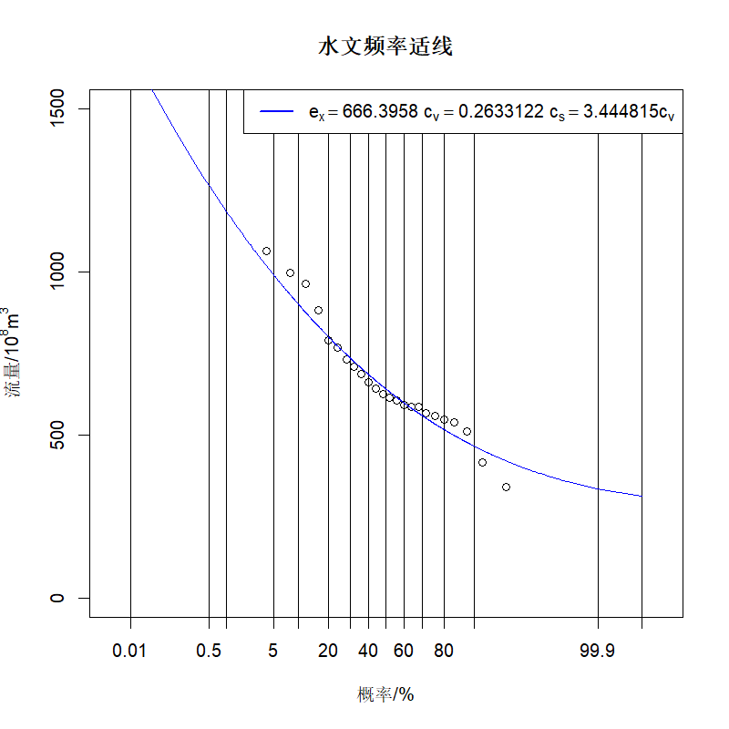

# Draw-Pearson-Type-III

绘制水文统计中的皮尔逊3型曲线

# 测试数据来源

《工程水文学(第4版)》 中国水利水电出版社 P164 习题6-3

# 效果

# 参考文献

[1]何妹,赵华荣,姚越,金鑫.基于R软件优化绘制皮尔逊Ⅲ型频率曲线[J].人民珠江,2021,42(02):7-11.

[2]谢子波,鲁帆,朱奎,宋昕熠.基于R软件的水文频率计算适线绘制[J].水电能源科学,2018,36(01):20-23.